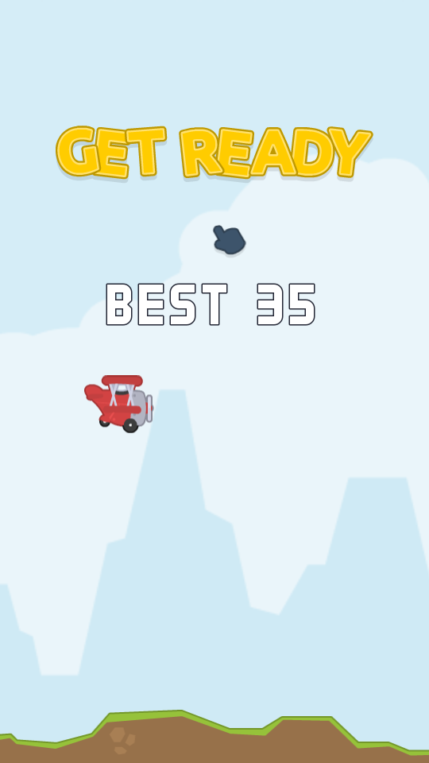
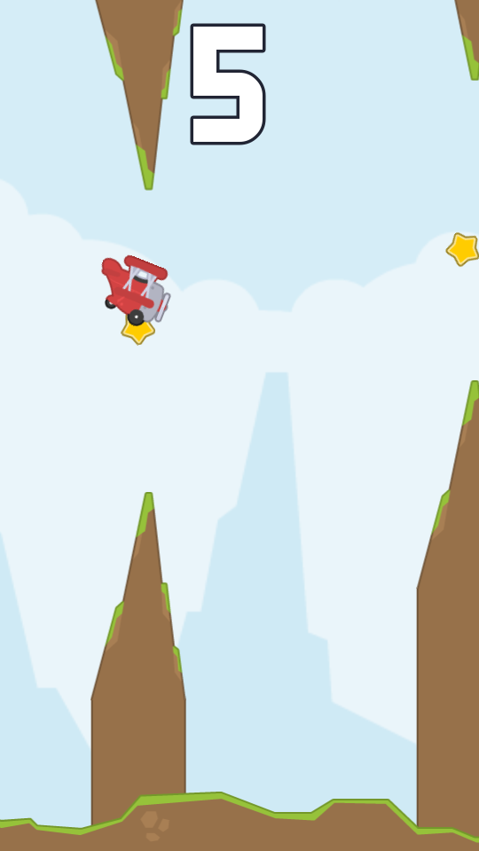
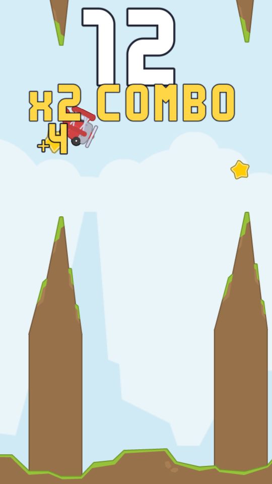
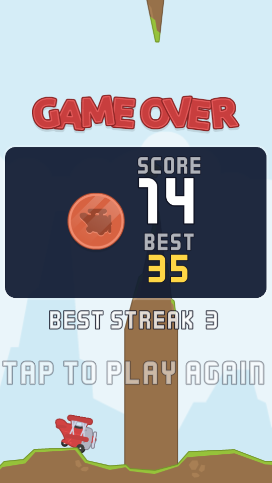

# Star Hopper

A one-tap endless flyer for Android, built in Godot 4.3 with Kenney's CC0 art and audio.

Tap to flap. Thread the rock gates. Sweep up stars to build a combo multiplier — then decide
whether the next star is worth the line it takes.

| Ready | In flight | Combo | Game over |
|---|---|---|---|
|  |  |  |  |

## The hook

Plain flappy games are pure survival, so every run plays the same. Star Hopper adds a
risk/reward layer on top of the survival loop:

- **Clearing a gate** scores `1 × multiplier`.
- **Collecting that gate's star** scores `2 × multiplier` and extends your streak.
- **Missing a star that was there** breaks the streak back to zero.

The multiplier steps up with the streak — `x2` at 3, `x3` at 6, `x5` at 10. Stars are placed
anywhere inside the gap, so a greedy line often means flying much closer to the rock than
survival alone would require. Playing it safe caps you at roughly a fifth of a good run's score.

Difficulty ramps over the first 40 gates: speed `265 → 470 px/s`, gap `345 → 248 px`. Your best
score is stored locally, and crossing it mid-run flashes on screen — which is usually the moment
the run falls apart.

## Running it

Open the project folder in Godot 4.3, or from the command line:

```bash
godot --path .
```

## Automated builds

Every push to `main` builds a signed release APK via [`.github/workflows/android.yml`](.github/workflows/android.yml).
The workflow imports assets, runs the headless gameplay test, exports the APK, verifies the
signature and uploads it as a build artifact. Grab it from the **Actions** tab → the run →
**Artifacts** → `star-hopper-apk-<sha>`.

Builds are signed with a throwaway key generated per run, which is fine for sideloading and
testing. For a key that stays stable across releases (required by Google Play), set these
repository secrets and the workflow uses them instead:

| Secret | Value |
|---|---|
| `ANDROID_KEYSTORE_BASE64` | `base64 -w0 your-release.keystore` |
| `ANDROID_KEYSTORE_USER` | the key alias |
| `ANDROID_KEYSTORE_PASSWORD` | the keystore/key password |

The Android `versionCode` is stamped from the workflow run number, so every build is an
upgrade over the last.

## Testing

`tests/smoke_test.gd` boots the real scene in a headless `SceneTree`, plays it with an
autopilot that aims at stars, deliberately crashes, and restarts — asserting that scoring,
streaks, death and restart all work. CI fails the build on any engine or script error logged
during gameplay.

```bash
godot --headless --path . --script tests/smoke_test.gd
```

`tests/screenshot.gd` renders the images above from real frames. It needs a display, so under
a headless machine run it through Xvfb:

```bash
xvfb-run -a godot --path . --resolution 540x960 --script tests/screenshot.gd -- docs/screenshots
```

## Layout

```
scenes/       Main, Player and Obstacle scenes
scripts/      game loop, player, obstacle, UI, autoloads (Save / Audio)
assets/       sprites, audio, fonts and launcher icons (Kenney, CC0)
tools/        launcher icon generator (stdlib Python, no Pillow)
tests/        headless smoke test and screenshot harness
```

Two notes on how it is put together:

**Rock gates stretch seamlessly.** The Kenney rock sprites are fixed 108×239 cones, but a gate
has to reach from the gap edge to off-screen at any height. Each rock draws the cone with its
outlined cap cropped off, then extends it with a 2px cross-section slice scaled vertically and
sampled with nearest filtering — so a gate of any height has no visible seam.

**The viewport adapts to the phone.** Width is pinned at 540px (`keep_width`) and height follows
the device aspect, so the ground line, sky tiling and the plane's rest position are derived at
startup rather than hard-coded.

## Credits

All art, audio and fonts by [Kenney](https://kenney.nl) — Tappy Plane, Retro Sounds 2 and the
Kenney font pack — released under CC0. The launcher icons are composited from the Tappy Plane
sprite by `tools/make_icons.py`.

Game code is MIT licensed — see [LICENSE](LICENSE).
